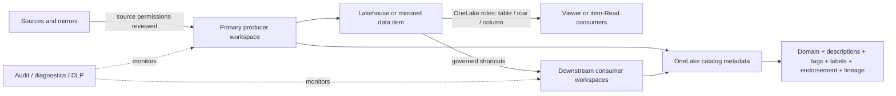

# Microsoft Fabric OneLake catalog governance POC

A customer-ready reference for assessing and improving governance in an **existing Microsoft Fabric workspace** that can contain lakehouses, warehouses, notebooks, data pipelines, semantic models, mirrored items, shortcuts, and other Fabric items.

OneLake catalog is built into Fabric; it is not a separate service to deploy. This repository operationalizes the practices that make catalog entries useful and safe: durable business domains, meaningful metadata, controlled tags, sensitivity labels, endorsement gates, least privilege, OneLake security, lineage, source-boundary reviews, lifecycle management, and auditing.

The toolkit is passwordless, dry-run first, non-destructive, and designed for a public repository. It never writes Fabric, tenant, subscription, item, connection, or principal IDs to generated assessment reports.

## What this POC includes

- An inventory/assessment CLI that works across an existing workspace and unknown future item types.
- A versioned YAML governance policy with item metadata, naming, tags, and OneLake security role intent.
- Conservative remediation for workspace/item descriptions, domain assignment, and existing tags.
- An optional Fabric-admin bootstrap for a missing domain and controlled tenant tags.
- ETag-protected OneLake role updates that preserve all other roles and always run the Fabric server-side dry-run first.
- A small synthetic Fabric estate: lakehouse, warehouse, notebook, pipeline, and two classification-oriented tables.
- A control matrix, adoption runbook, architecture, limitations, security/release guidance, and an LLM code-editor prompt.
- Unit tests and GitHub Actions checks for code quality, dependencies, secrets, and accidental environment identifiers.

## Governance model



The recommended security baseline centralizes ownership and enforcement in a primary workspace, then uses shortcuts for downstream consumption. Workspace Admins, Members, and Contributors are not restricted by OneLake security roles, so enforcement tests must use a Viewer or item-Read identity. SQL analytics endpoints also need **user identity mode** for OneLake security evaluation.

## Quick start against an existing workspace

Prerequisites: Python 3.11+, Azure CLI, access to the target Fabric workspace, and an active Fabric capacity.

```powershell
az login
python -m venv .venv
.\.venv\Scripts\Activate.ps1
python -m pip install -e ".[dev]"
Copy-Item .env.example .env
```

Set `FABRIC_WORKSPACE_NAME` in the ignored `.env`, or pass `--workspace`. The CLI uses `DefaultAzureCredential`; it does not accept client secrets or tokens.

```powershell
# Assess only. Output goes to the ignored reports/ directory.
onelake-governance assess --workspace "My Fabric Workspace"

# Preview safe metadata changes.
onelake-governance remediate --workspace "My Fabric Workspace" --domain "Approved Domain"

# Apply exactly that conservative subset. No item deletion, rename, or access change.
onelake-governance remediate --workspace "My Fabric Workspace" --domain "Approved Domain" --apply
```

Edit [policy/governance-policy.yaml](policy/governance-policy.yaml) before applying it to a customer tenant. A failed control is release-blocking; warnings and manual controls require an owner and disposition.

## Optional synthetic demo estate

The bootstrap is idempotent and dry-run by default. It will not provision, resize, start, or delete a Fabric capacity.

```powershell
onelake-governance bootstrap-demo `
  --workspace "fabric-onelake-catalog-governance-poc" `
  --capacity "<active capacity>" `
  --domain "<approved existing domain>"

# Create/update the items and run the synthetic seeding notebook.
onelake-governance bootstrap-demo `
  --workspace "fabric-onelake-catalog-governance-poc" `
  --capacity "<active capacity>" `
  --domain "<approved existing domain>" `
  --apply --run-seed
```

The demo data uses conspicuous synthetic identifiers and the reserved `.invalid` email domain. It is still treated as sensitive-like so that controls can be demonstrated.

## Admin and data-owner workflows

Creating domains and controlled tag definitions requires a Fabric administrator. Preview the change first:

```powershell
onelake-governance admin-bootstrap
onelake-governance admin-bootstrap --apply
```

OneLake role membership uses Entra security groups supplied only through the process environment:

```powershell
$env:FABRIC_TENANT_ID = "<tenant-id>"
$env:FABRIC_PUBLIC_READER_GROUP_ID = "<security-group-object-id>"

# Calls Fabric's server-side dry-run and makes no change.
onelake-governance apply-onelake-role `
  --workspace "My Fabric Workspace" `
  --lakehouse governed_curated_lh `
  --role PublicMetricsReader

# Repeats the dry-run, then applies with the GET ETag.
onelake-governance apply-onelake-role `
  --workspace "My Fabric Workspace" `
  --lakehouse governed_curated_lh `
  --role PublicMetricsReader --apply
```

Do not narrow or delete `DefaultReader` until every effective access path has been reviewed. A grant from another role or permission model cannot be overridden with a deny.

## Customer adoption path

1. Read [docs/adoption-runbook.md](docs/adoption-runbook.md) and identify governance owners.
2. Copy the policy and replace the sample domain, tag vocabulary, item descriptions, and group environment-variable names.
3. Assess the existing workspace and triage every failure/warning/manual check.
4. Have tenant/domain administrators implement approved domain, tag, sensitivity, endorsement, DLP, and audit policies.
5. Apply metadata remediation, then configure data-plane roles with Entra groups.
6. Test Spark, SQL, OneLake APIs, shortcuts, reports, and export paths using least-privileged identities.
7. Reassess in CI or on a schedule, store reports in a protected evidence location, and repeat after material changes.

Use [prompt/LLM_CODE_EDITOR_PROMPT.md](prompt/LLM_CODE_EDITOR_PROMPT.md) with a code editor LLM to adapt the repository while keeping its safety boundaries.

## Documentation

- [Architecture and trust boundaries](docs/architecture.md)
- [Control matrix](docs/control-matrix.md)
- [Customer adoption runbook](docs/adoption-runbook.md)
- [Live validation record](docs/live-validation.md)
- [Known limitations](docs/known-limitations.md)
- [Security and public-release process](SECURITY.md)

## Microsoft references

- [OneLake catalog overview](https://learn.microsoft.com/fabric/governance/onelake-catalog-overview)
- [Fabric governance and compliance overview](https://learn.microsoft.com/fabric/governance/governance-compliance-overview)
- [OneLake security best practices](https://learn.microsoft.com/fabric/onelake/security/best-practices-secure-data-in-onelake)
- [Data security in OneLake](https://learn.microsoft.com/fabric/onelake/security/get-started-security)
- [Tags in Microsoft Fabric](https://learn.microsoft.com/fabric/governance/tags-overview)
- [Domain design best practices](https://learn.microsoft.com/fabric/governance/domains-best-practices)
- [Endorse Fabric and Power BI items](https://learn.microsoft.com/fabric/fundamentals/endorsement-promote-certify)
- [Information protection in Fabric](https://learn.microsoft.com/fabric/governance/information-protection)
- [OneLake Catalog REST API overview](https://learn.microsoft.com/rest/api/fabric/articles/onelakecatalog/overview)

## License

[MIT](LICENSE). This POC is an accelerator, not a compliance certification or Microsoft-supported product.
