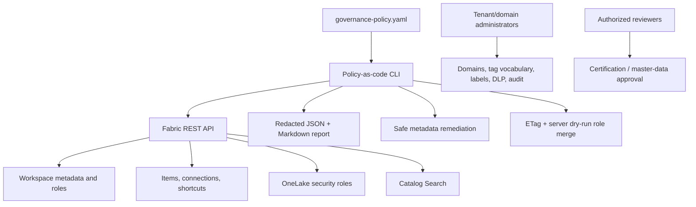

# Architecture and trust boundaries

## Design goals

The solution must work with a workspace that already exists, discover items it has never seen, produce actionable evidence without leaking tenant inventory, and separate safe automation from governance decisions requiring human approval.

## Security planes

| Plane | Examples | Repository behavior |
|---|---|---|
| Azure management | Capacity lifecycle, subscription RBAC, cost | Read-only discovery; no capacity provisioning or start/resize |
| Fabric control | Workspace roles, item permissions, sharing | Counts assignments by role/principal type; never emits identities |
| OneLake data | Table/folder, row, column, Read/ReadWrite | Inventories roles; changes one policy role only with full preservation, ETag, and server dry-run |
| Workload engine | SQL grants/RLS, semantic-model RLS, Spark | Requires engine-specific least-privilege validation |
| Source | Mirrored/shortcut source permissions and credentials | Counts references and creates a mandatory review control |
| Compliance | Purview labels, DLP, audit, retention | Assesses visible labels; leaves tenant policies to authorized administrators |

Permissions are additive across planes. OneLake roles are grants, not denies. Source permissions are not automatically recreated on mirrored targets, and shortcut access must satisfy both the shortcut path and target path.

## Public-repository boundary

Environment identifiers are accepted at runtime and used only in memory. Reports contain names, counts, status, and recommendations—not IDs, URLs, principals, connection details, credentials, or data samples. Reports are ignored because even a workspace name can be customer-sensitive.

The checked-in Fabric notebook has no output. Its data is deterministic, synthetic, and unsuitable for production performance testing.

## Recommended production topology

Use a primary producer workspace per durable ownership/security boundary. Apply OneLake security at the source item, use Viewer/item-Read consumers, and expose data to downstream workspaces through shortcuts. Keep development, test, and production workspaces/capacities separate. Configure SQL analytics endpoints in user identity mode where OneLake security must be enforced.

Fabric Git is source control for supported definitions, not a data backup or full tenant configuration backup. Connections, credentials, data, and unsupported settings need separate deployment/runbook controls.
